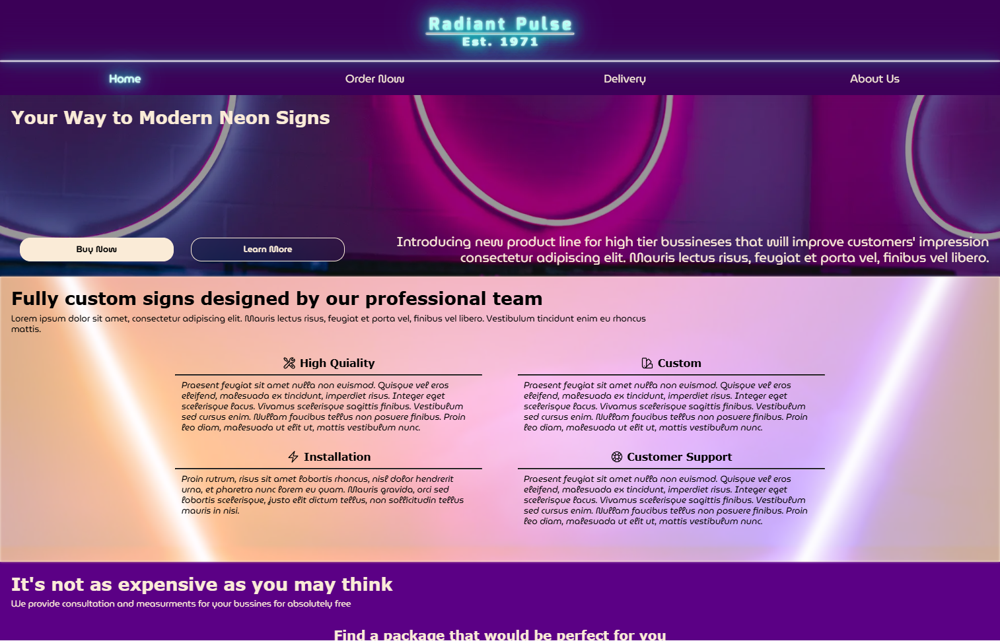

# Neon Lights Company Webpage

View on GitHub Pages: https://zabrafax.github.io/neon-lights-webpage/

> Webpage with neon effects using only HTML and CSS

## About This Project
This project is a fully responsive neon-themed webpage made with pure HTML & CSS.

🔹 No JavaScript required

🔹 Fully responsive on all devices

🔹 Inspired by cyberpunk and synthwave aesthetics

## Technologies Used
🔹 HTML5

🔹 CSS3 (Flexbox, Grid, Keyframes)

🔹 Google Fonts (for neon-style typography)

## Future Improvements
Add JavaScript for interactive elements

Create a dark/light mode switch

### GitHub: Zabrafax
